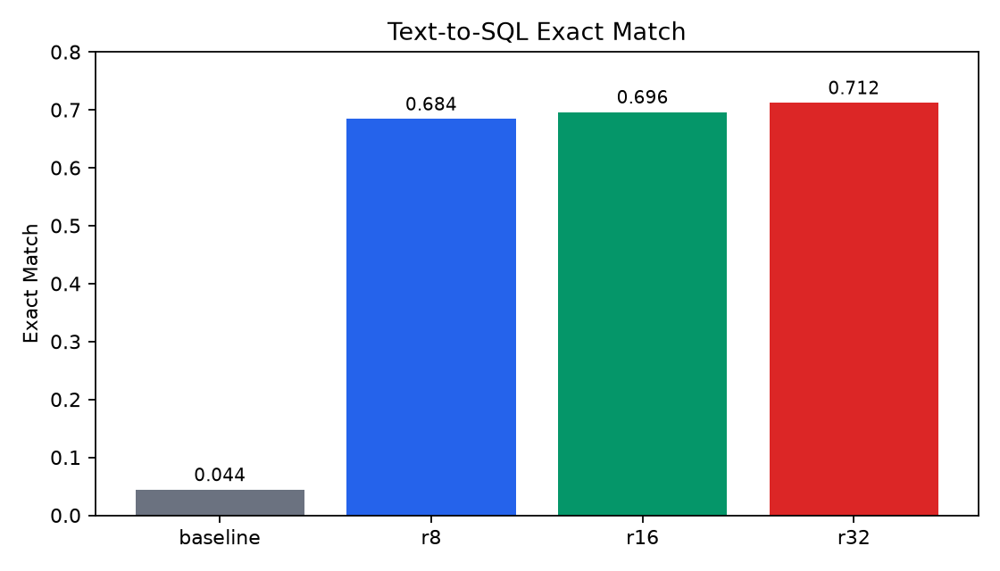
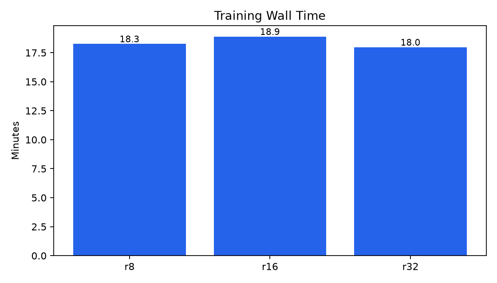
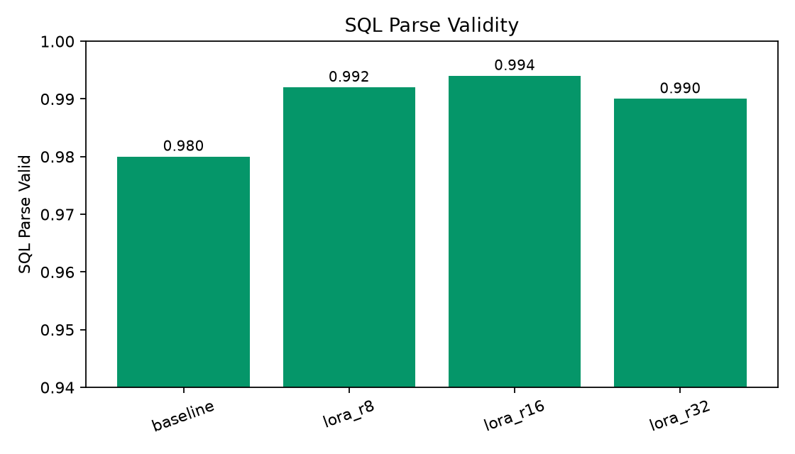
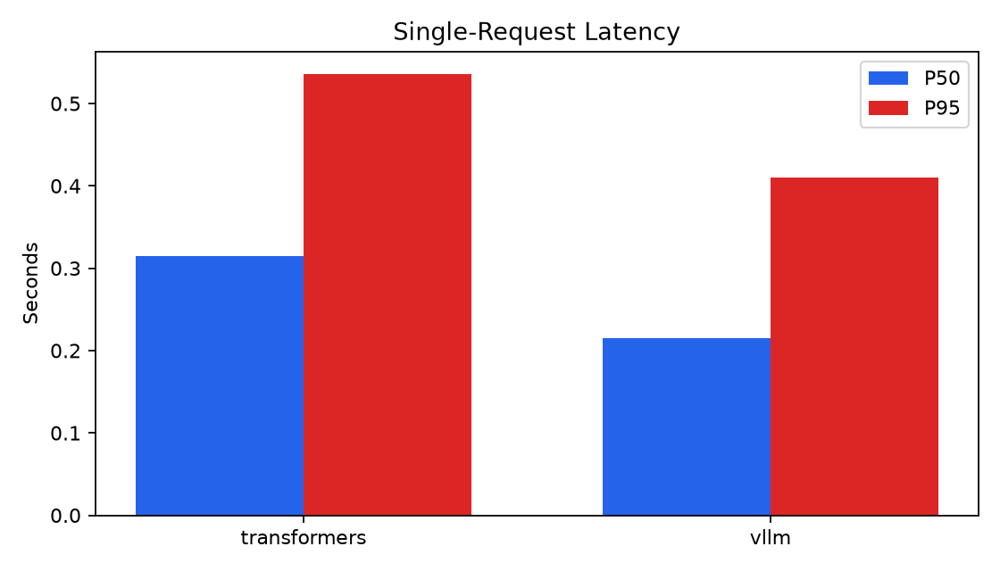
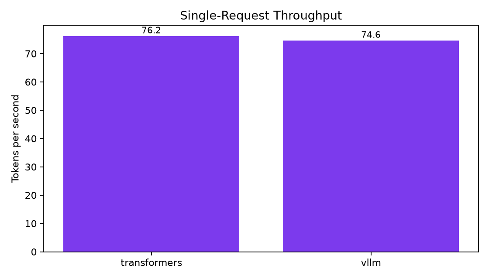

# Qwen QLoRA Text-to-SQL Benchmark

This repo is a reproducible Kaggle T4 project for QLoRA fine-tuning and serving benchmarks with `Qwen/Qwen2.5-1.5B-Instruct`.

## Scope

The first release answers three questions:

1. Can QLoRA fine-tuning run reliably on Kaggle T4 for Qwen2.5-1.5B-Instruct?
2. How do LoRA ranks 8, 16, and 32 affect Text-to-SQL quality, training time, and memory?
3. How does vLLM base-model serving compare with Transformers on latency and throughput?

## Experiment Design

| Track | Tooling | Output |
| --- | --- | --- |
| baseline quality | Transformers | base model predictions and metrics |
| fine-tuned quality | Transformers + PEFT | adapter predictions and metrics |
| serving benchmark | vLLM and Transformers | latency and throughput tables |

vLLM LoRA serving is not required for the first release.

Full technical writeup: [docs/TECHNICAL_REPORT.md](docs/TECHNICAL_REPORT.md)

## Dataset Notes

See [docs/DATASET_ANALYSIS.md](docs/DATASET_ANALYSIS.md) for split statistics, SQL pattern distribution, and baseline failure modes.

## Key Results

| Model | Exact Match | SQL Parse Valid | Main Remaining Error |
| --- | ---: | ---: | --- |
| baseline | 0.044 | 0.980 | filter or condition mismatch |
| LoRA rank 8 | 0.684 | 0.992 | filter or condition mismatch |
| LoRA rank 16 | 0.696 | 0.994 | filter or condition mismatch |
| LoRA rank 32 | 0.712 | 0.990 | filter or condition mismatch |

The fine-tuned adapters improve Exact Match from 4.4% to 71.2% on the 500-row eval split. The base model is already SQL-shaped, so the measured gain is mainly in matching dataset-specific query structure, selected columns, and filters.

## Repository Layout

```text
configs/      YAML experiment configs
data/         local data staging, ignored except directory markers
docs/         project specs and experiment log
notebooks/    Kaggle notebooks, one job per notebook
outputs/      adapters, checkpoints, diagnostics
results/      result tables, figures, logs, predictions
scripts/      shell entrypoints for Kaggle
src/          reusable Python package
tests/        local validation tests
```

## Local Validation

```bash
uv run --extra dev pytest
uv run --extra dev ruff check .
```

## Guarded Local API

The API exposes a local Text-to-SQL service with parse validation and read-only `SELECT` checks.

```bash
scripts/run_api.sh
```

Example request:

```bash
curl -s http://127.0.0.1:8000/generate-sql \
  -H 'content-type: application/json' \
  -d '{
    "schema": "CREATE TABLE users (name TEXT, country TEXT)",
    "question": "List user names from Canada"
  }'
```

The response includes `sql`, `parse_valid`, `is_select_only`, `latency_ms`, and `error`. The API still requires the local adapter artifacts under `outputs/adapters/lora_r32` for real generation.

Optional SQLite sandbox execution:

```bash
curl -s http://127.0.0.1:8000/generate-sql \
  -H 'content-type: application/json' \
  -d '{
    "schema": "CREATE TABLE users (name TEXT, country TEXT)",
    "question": "List user names from Canada",
    "execute": true,
    "setup_sql": [
      "CREATE TABLE users (name TEXT, country TEXT)",
      "INSERT INTO users VALUES (\"Alice\", \"Canada\")"
    ],
    "max_rows": 20,
    "timeout_ms": 1000
  }'
```

Sandbox execution accepts only one generated read-only `SELECT` statement and returns `execution_valid`, `row_count`, `rows`, and `execution_error`.

## Kaggle Setup

```bash
pip install -r requirements-kaggle.txt
scripts/kaggle_setup_check.sh
scripts/kaggle_prepare_dataset.sh
```

## Current Status

Project scaffold is ready. The first dataset is `b-mc2/sql-create-context`; exact fields have been verified as `answer`, `question`, and `context`.

## Prepare Dataset

```bash
uv run --extra data python -m qwen_qlora_sql_benchmark.data.download_sql_create_context
```

## Run Baseline

On Kaggle or another Linux GPU runtime:

```bash
scripts/kaggle_baseline.sh
```

Current baseline result:

| Model | Eval rows | Exact Match | Runtime |
| --- | ---: | ---: | ---: |
| Qwen2.5-1.5B-Instruct | 500 | 0.044 | 185.80 seconds |

Current diagnostic result:

| Model | Eval rows | Exact Match | Runtime |
| --- | ---: | ---: | ---: |
| baseline on first 50 rows | 50 | 0.04 | already generated |
| LoRA rank 8 diagnostic | 50 | 0.48 | 64.98 seconds |

Current full rank 8 result:

| Model | Eval rows | Exact Match | Runtime |
| --- | ---: | ---: | ---: |
| Qwen2.5-1.5B-Instruct | 500 | 0.044 | 185.80 seconds |
| LoRA rank 8 | 500 | 0.684 | 568.25 seconds |
| LoRA rank 16 | 500 | 0.696 | 657.88 seconds |
| LoRA rank 32 | 500 | 0.712 | 530.83 seconds |

Current finding: rank 32 has the best Exact Match result, while rank 8 is close and cheaper in adapter size. This is still an Exact Match result, not a database execution result.

Quality metrics:

| Model | Exact Match | SQL Parse Valid |
| --- | ---: | ---: |
| baseline | 0.044 | 0.980 |
| LoRA rank 8 | 0.684 | 0.992 |
| LoRA rank 16 | 0.696 | 0.994 |
| LoRA rank 32 | 0.712 | 0.990 |

See [docs/EVAL_ANALYSIS.md](docs/EVAL_ANALYSIS.md) for interpretation and limitations.

Error analysis:

| Model | Exact Match | Filter/Condition Mismatch | Projection Mismatch | Invalid SQL |
| --- | ---: | ---: | ---: | ---: |
| baseline | 0.044 | 0.736 | 0.182 | 0.020 |
| LoRA rank 8 | 0.684 | 0.164 | 0.132 | 0.006 |
| LoRA rank 16 | 0.696 | 0.154 | 0.136 | 0.004 |
| LoRA rank 32 | 0.712 | 0.146 | 0.126 | 0.008 |

See [docs/ERROR_ANALYSIS.md](docs/ERROR_ANALYSIS.md) for the classification method and limitations.

Deployment smoke test:

| Model | Cases | Parse Valid | Execution Match | Average Latency |
| --- | ---: | ---: | ---: | ---: |
| base model | 6 | 6 | 4 | 0.390s |
| LoRA rank 32 | 6 | 6 | 5 | 0.571s |

See [docs/DEPLOYMENT_READINESS.md](docs/DEPLOYMENT_READINESS.md) for the deployment assessment.

## Figures










